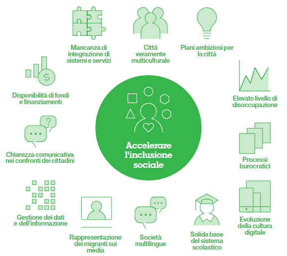

.. _h5a3e7d163545a53223d332950303a4e:

1 . Executive Summary
#####################

“Il Challenge” della città: Far crescere ulteriormente la città di Palermo rendendola un luogo più inclusivo per migranti, nuovi residenti e tutti i cittadini palermitani, attraverso l’uso della tecnologia e di partnership sostenibili.

\ |STYLE0|\ 

\ |IMG1|\ 

\ |STYLE1|\ 

* L’infrastruttura tecnologica e i processi della città di Palermo non sono integrati in maniera coerente

* I cittadini e le organizzazioni di Palermo richiedono una maggiore condivisione delle informazioni 

* Il processo di “rescue-to-residency” (R2R), creato per la prima ondata di emergenza dei migranti, è manuale e burocratico e non riflette le attuali esigenze di Palermo 

* La complessità organizzativa e la burocrazia sono presenti nei sistemi di gestione della città 

* Il disallineamento delle competenze e un approccio non strutturato che non favorisce l’incontro tra domanda e offerta contribuiscono alla disoccupazione 

* Portare i nuovi cittadini al livello di istruzione di base adeguato al contesto richiede molto tempo, indipendentemente dai precedenti livelli di istruzione raggiunti nei rispettivi Paesi d’origine 

* Assicurare un alloggio sociale è un’impresa difficile per chi è nel bisogno.

.. _h4151155e121d3d61197370605b6a5a65:

Riepilogo delle raccomandazioni
*******************************

.. _h67544581328523d58293148212c645f:

\ |IMG2|\ Formazione scolastica 
================================

Stabilire un agile processo formale per raggiungere il livello di istruzione obbligatorio in Italia e sviluppare una piattaforma di e-learning che promuova le competenze linguistiche e lavorative di base.

\ |STYLE2|\ 

Maggiori opportunità occupazionali per promuovere una maggiore inclusione sociale e  favorire il benessere fisico e  mentale dei cittadini 

.. _h5f1d74365164420745f82e76653039:

\ |IMG3|\ Occupazione
=====================

Sviluppare una versione digitale del processo di “passaparola” per far crescere il livello di occupazione, sviluppare un portale online “one-stop” per i potenziali imprenditori palermitani e implementare un processo che consenta alle persone in attesa di permesso di soggiorno o ai richiedenti asilo di essere attivi attraverso progetti / apprendistati / tirocini.

\ |STYLE3|\ 

Maggiore coinvolgimento dei cittadini grazie a una migliore formazione e allo sviluppo di competenze

.. _h41221c50392e796a4846754c7e1f6570:

\ |IMG4|\ Alloggi
=================

Implementare un sistema di gestione degli alloggi sociali per fornire un controllo centralizzato della lista degli alloggi sociali della città

\ |STYLE4|\ 

Miglioramento della sicurezza e dell’autosufficienza per i più vulnerabili attraverso un maggiore accesso agli alloggi sociali.

.. _h2d803229d112019331b691e7618165:

\ |IMG5|\ Comunicazione
=======================

Ampliare il sito web esistente per dare vita a un’efficace sistema di comunicazione a due vie tra Palermo e i suoi cittadini.

\ |STYLE5|\ 

Migliore inclusività attraverso una migliore comunicazione tra la città, le organizzazioni e i suoi cittadini.

.. _h196365321e572f3f63711221574134d:

\ |IMG6|\ Tecnologia
====================

Sfruttare le capacità delle soluzioni di analytics per promuovere un migliore processo decisionale; sviluppare un processo tecnologico a beneficio dei migranti; raccogliere informazioni attraverso una migliore raccolta, condivisione e analisi dei dati e guidare il futuro della città attraverso lo sviluppo di una nuova generazione di talenti nell’ambito dell’IT.

\ |STYLE6|\ 

Applicazioni e processi IT efficienti per un processo decisionale più informato e per “abilitare” il cittadino.

.. _h43c664e744053211d13697613261d:

\ |IMG7|\ Governance
====================

Sviluppare e implementare un quadro di governance e un sistema di gestione per guidare e coordinare la realizzazione delle raccomandazioni contenute in questo rapporto.

\ |STYLE7|\ 

Costruire la reputazione di Palermo come centro di competenza digitale

|

.. bottom of content

.. |STYLE0| replace:: **La nostra visione del contesto di Palermo**

.. |STYLE1| replace:: **Osservazioni principali**

.. |STYLE2| replace:: **Risultati attesi**

.. |STYLE3| replace:: **Risultati attesi**

.. |STYLE4| replace:: **Risultati attesi**

.. |STYLE5| replace:: **Risultati attesi**

.. |STYLE6| replace:: **Risultati attesi**

.. |STYLE7| replace:: **Risultati attesi**

.. |IMG3| image:: static/1-executive_summary_3.png
   :height: 100 px
   :width: 104 px

