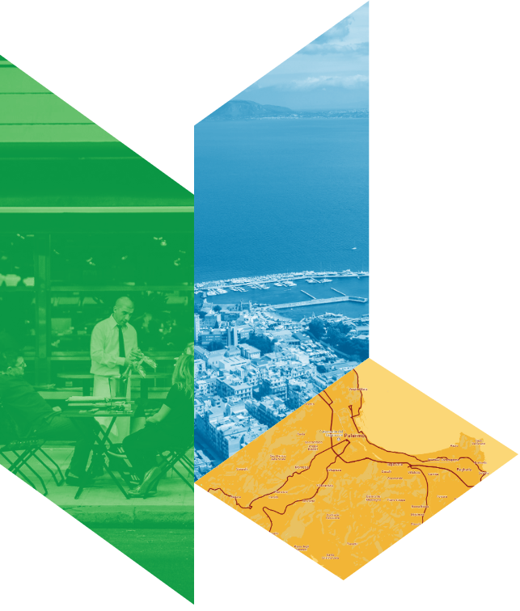
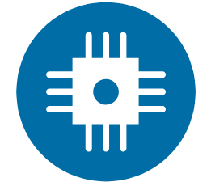

.. _h203978782b1b1a177f1d284b24b751:

2 . Introduzione
****************

.. _h7832ca243e7be7e231f2394145d:

A . The Smarter Cities Challenge
================================

Entro il 2050, il 66% della popolazione mondiale vivrà in ambienti urbani, con la maggior parte della crescita che si concentrerà nelle città di medie e piccole dimensioni. L’urbanizzazione, associata a una crescente decentralizzazione, ha costretto le autorità locali a diventare più autosufficienti e ad aumentare la loro capacità di finanziare i servizi e le istituzioni, trasformando le città in incubatori in grado di testare nuove politiche pubbliche e iniziative guidate dalle autorità locali. Molte città sono particolarmente vulnerabili ai cambiamenti climatici, a causa della loro ubicazione, compresi i grandi centri abitati che si trovano nei delta fluviali, lungo le coste e nelle regioni soggette a siccità. Mentre le città di tutto il mondo devono affrontare significativi cambiamenti dei modelli meteorologici storici e un aumento degli eventi meteorologici estremi, è sempre più importante sviluppare efficaci strategie di resilienza a livello locale. Anche l’ampia migrazione transfrontaliera ha avuto implicazioni significative per le comunità urbane, generando sia opportunità che sfide per le città che ricevono flussi di migranti. Infatti, i grandi flussi migratori possono rapidamente aumentare la necessità di servizi urbani, come alloggi a prezzi accessibili, opportunità di lavoro e servizi sanitari.

Ma con l’invecchiamento della popolazione in Europa e in altre regioni, le città potranno beneficiare di migranti che andranno ad ovviare alla carenza di competenze e dare nuova linfa alle economie locali.

La disuguaglianza è salita ai massimi livelli negli ultimi trent’anni, combinandosi in maniera significativa con le altre tendenze. La rapida crescita della popolazione dovuta all’urbanizzazione minaccia la capacità di molte città di fornire servizi ai cittadini più svantaggiati, come l’accesso ad alloggi a prezzi accessibili, occupazione, trasporti e assistenza sanitaria. Le fasce di popolazione a basso reddito devono spesso sopportare in maniera squilibrata gli impatti negativi dei cambiamenti climatici, mentre i migranti sono spesso una popolazione vulnerabile, il cui accesso al capitale sociale e finanziario è stato notevolmente impattato da questa situazione. Queste tendenze urbane evidenziano ambiti prioritari in cui città e regioni devono investire e sviluppare capacità per sostenere le esigenze dei loro cittadini attuali e futuri.

Nel frattempo, i rapidi progressi tecnologici in settori come i big data e il cognitive computing stanno consentendo ai dirigenti comunali di affrontare questioni complesse e prendere decisioni migliori per fornire servizi in modo più efficace, equo ed efficiente. L’esplosione dei dati in tempo reale provenienti da quasi 13 miliardi di dispositivi connessi a Internet offre ai decisori politici la possibilità di monitorare aspetti come l’utilizzo di energia, le condizioni ambientali o la congestione del traffico, apportando modifiche volte a ridurre lo spreco di energia negli edifici, diminuire la congestione del traffico e avvertire i residenti in caso di eventi meteorologici potenzialmente pericolosi – il tutto in tempo reale.

IBM Smarter Cities Challenge mette a disposizione delle città di tutto il mondo i migliori talenti e la tecnologia di IBM per affrontare le sfide strategiche più urgenti. Le città vincitrici accolgono un team di esperti IBM che vengono impiegati a tempo pieno nella città per tre settimane.

I team IBM sfruttano il cognitive computing, la piattaforma cloud, l’analytics mobile e social e le funzionalità complete di analisi dei dati meteorologici dell’azienda per fornire ai vincitori della Smarter Cities Challenge nuovi spunti basati sui dati relativi alle loro sfide urbane e consentire loro di generare e valutare opzioni per migliorare lo sviluppo delle policy e del processo di presa decisionale.

In seguito a un processo di selezione, Palermo è stata scelta tra le 16 città a cui è stata assegnata una sovvenzione Smarter Cities Challenge nel biennio 2016-2017.

Per un periodo di tre settimane, nel novembre 2017, un team di sei esperti IBM ha lavorato a Palermo per fornire raccomandazioni su tematiche chiave per il sindaco di Palermo, Leoluca Orlando.

\ |IMG1|\ \ |STYLE0|\ 

Siamo in grado di misurare, percepire e vedere la condizione di praticamente tutto.

\ |IMG2|\ \ |STYLE1|\ 

Persone, sistemi e oggetti possono comunicare e interagire tra loro in maniera completamente nuova-

\ |IMG3|\  \ |STYLE2|\ 

Siamo in grado di analizzare e ricavare idee e spunti da fonti di informazione ampie e diversificate per prevedere e rispondere meglio ai cambiamenti

Figura 1: Strutturato, interconnesso, intelligente

|

.. _h22356b76705a632960f56536431126:

B. La sfida
===========

In quanto capoluogo della regione Sicilia, Palermo ha ricevuto un’ampia percentuale dei 160.000 migranti che sono giunti in Italia nel 2016. Palermo vede questa come un’opportunità per rendere la città più inclusiva, dando vita a un percorso adeguato di accoglienza, di primo soccorso e di integrazione per ogni migrante. Con un obiettivo di inclusione sociale all’interno del tessuto culturale ed economico della città di Palermo, il sindaco Orlando ha invitato il team Smarter Cities Challenge (SCC) di IBM a trasformare l'arrivo di migranti in un’opportunità per Palermo, per i suoi nuovi residenti e per tutti i cittadini palermitani, seguendo due piste principali:

* Aiutare la città di Palermo a diventare più smart, più aperta e inclusiva per tutte le fasce deboli della popolazione, con un’attenzione particolare rivolta ai migranti. 

* Progettare processi e implementare sistemi economicamente sostenibili e vantaggiosi, facilmente replicabili e scalabili; concentrandosi su come facilitare l’accesso ai servizi educativi, sanitari e per l’orientamento e l’inserimento lavorativo.

Nell’ambito di questo progetto, il team Smarter Cities Challenge di IBM ha incontrato i principali stakeholder della città: dagli assessori della giunta comunale alle organizzazioni non governative (ONG) come la Croce Rossa e l’UNICEF, dalle istituzioni cittadine come il Teatro Massimo alle organizzazioni locali che lavorano in contatto diretto con la comunità.

Tutti hanno condiviso l'importanza della sfida, che può essere così sintetizzata: \ |STYLE3|\ 

|

.. bottom of content

.. |STYLE0| replace:: **Strutturato**

.. |STYLE1| replace:: **Interconnesso**

.. |STYLE2| replace:: **Intelligente**

.. |STYLE3| replace:: **Far crescere ulteriormente la città di Palermo rendendola un luogo più inclusivo per migranti, nuovi residenti e tutti i cittadini palermitani, attraverso l’uso della tecnologia e di partnership sostenibili.**

