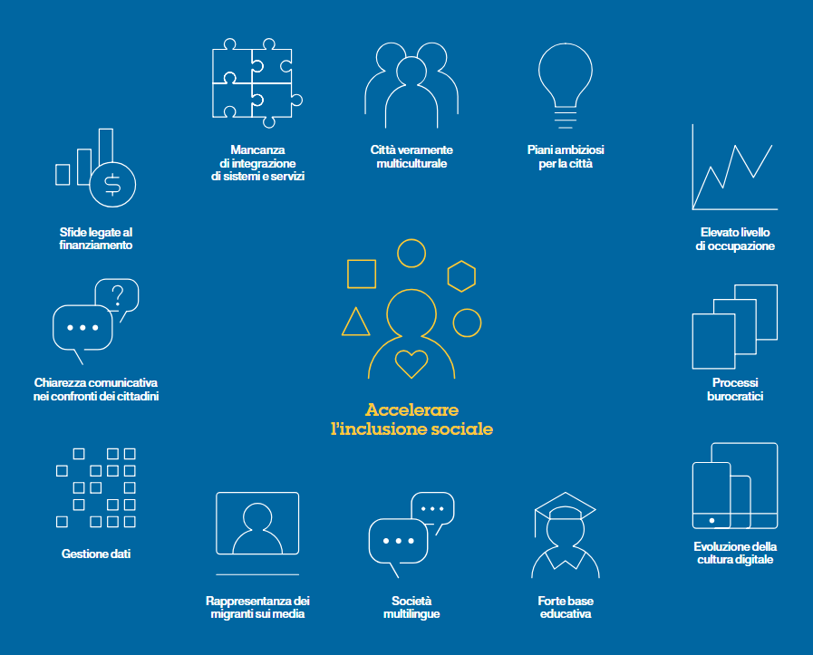
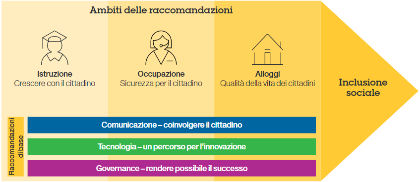
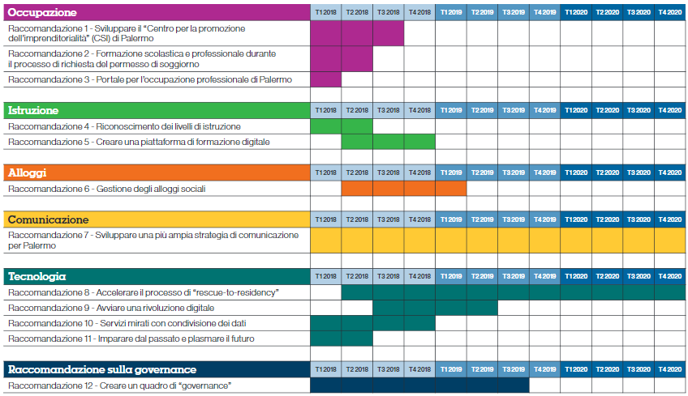

.. _h2d7c3ef6021105950533c62dfc79:

3 . Osservazioni, contesto e road map
*************************************

.. _h263b2349227f221d665815784e781055:

A . Osservazioni e contesto
===========================

* Palermo vanta un patrimonio veramente multiculturale e interculturale, con oltre 2.700 anni di storia. Questo è evidente in tutta la città, dai segnali stradali alla sua architettura e alla sua popolazione. 

* Il sindaco Orlando e il suo team, così come i responsabili delle associazioni e delle imprese, sono tutti fiduciosi riguardo al futuro e hanno piani ambiziosi per Palermo. Questo si è palesato ulteriormente con la nomina di Palermo come Capitale italiana della Cultura 2018 e la mostra Manifesta 12, tra gli altri. 

* La disoccupazione in Sicilia arriva al 22%. Il numero di occupati è aumentato nel 2016 ma, a causa del numero di persone che si sono affacciate sul mercato del lavoro, anche la disoccupazione generale è aumentata. (EURES - Portale europeo della mobilità professionale: informazioni sul mercato del lavoro). 

* Palermo è frenata dai processi burocratici, sia a livello comunale che per la normativa in vigore a livello regionale e nazionale. 

* La cultura digitale della città è in continua crescita ed evoluzione, come dimostrano le aree Wi-Fi gratuite, il collegamento in fibra e l’erogazione di servizi online, come il pagamento di tasse locali.

* Palermo ha una solida base educativa che è messa a disposizione di tutti i minori, indipendentemente dalla loro estrazione sociale o  dal Paese d’origine. 

* La natura stessa di Palermo come città multiculturale si è espressa, nel corso dei secoli, con la diffusione di svariate lingue come l’arabo e l’ebraico. Tuttavia, questo è aumentato significativamente negli ultimi anni con l’afflusso di migranti, con nuove lingue che stanno creando una società multilingue. 

* Mentre molti cittadini di Palermo si aprono alla società multiculturale in cui vivono e danno il benvenuto ai nuovi cittadini, i media continuano a concentrarsi sugli aspetti negativi dei migranti che risiedono in città. 

* I dati e le informazioni all’interno del Comune sono gestiti da dipartimenti separati e non facilmente accessibili da chi potrebbero avere bisogno di tali informazioni. 

* Vi è una scarsa chiarezza comunicativa nei confronti dei cittadini, il che è confermato dall’assenza di un luogo in cui trovare informazioni o approfondire la comprensione delle politiche cittadine. 

* Come avviene per la maggior parte delle giunte locali, Palermo ha difficoltà a finanziare i servizi che intende offrire ai propri cittadini. Tuttavia è molto attiva nel richiedere sovvenzioni all’UE e altri sussidi per integrare il proprio bilancio. 

* Vi è una mancanza di integrazione dei sistemi e dei servizi nell’ecosistema di dipartimenti, organizzazioni e associazioni, che sarebbe invece necessaria per far funzionare la città in maniera efficace.

\ |STYLE0|\ 

\ |IMG1|\ 

L’infrastruttura e i processi tecnologici di Palermo non sono coerentemente integrati in tutte le organizzazioni della municipalità per supportare la vision per la città.

\ |IMG2|\ 

I cittadini e le organizzazioni di Palermo (ONG, associazioni, imprese, ecc.) richiedono una maggiore condivisione delle informazioni e un approccio comunicativo strutturato. Inoltre, il Comune non dispone attualmente di metodologie strutturate per ottenere feedback tempestivi.

\ |IMG3|\ 

Il processo "Resque to Residency" (R2R) creato per l’iniziale ondata di emergenza di migranti è manuale e burocratico; può essere migliorato per supportare l’attuale flusso migratorio, coinvolgendo tutte le parti in causa.

\ |IMG4|\  

Complessità organizzative e burocratiche fanno parte dei sistemi di gestione della città, ulteriormente complicati dalle sue relazioni giuridiche e sociali con numerose entità pubbliche e private. I sistemi a silos che ne conseguono inibiscono l’implementazione di un processo decisionale efficace.

\ |IMG5|\  

La disoccupazione è causata da un disallineamento nella formazione delle competenze e da un approccio non strutturato tra domanda e offerta di lavoro. L’attuale spirito imprenditoriale di Palermo dovrebbe essere ulteriormente valorizzato.

\ |IMG6|\ 

Portare i nuovi cittadini al livello di istruzione di base richiesto richiede molto tempo e l’accessibilità a ulteriori risorse formative è limitata.

\ |IMG7|\  

Per chi ha bisogno di un alloggio sociale è difficile assicurarsi una residenza legale.

Figura 2: Osservazioni principali

\ |STYLE1|\ 

\ |IMG8|\ 

Figura 3: La nostra visione del contesto di Palermo

|

.. _h171749314b56752c1a3c1268561f372b:

B. Road map delle raccomandazioni
=================================

.. _h2413344415b6f2c1a27e6939464025:

La vision
---------

Il significato delle raccomandazioni formulate qui di seguito non può essere sottovalutato quando l’obiettivo è portare la città di Palermo nel 21° secolo. La sostituzione dei vecchi metodi basati su carta e penna con soluzioni tecnologiche è fondamentale per accelerare l’inclusione sociale a Palermo. Per avviare la rivoluzione digitale della città e dare a Palermo il ruolo di leader tecnologico innovativo nel Sud Europa, è fondamentale adottare un nuovo approccio di gestione delle attività quotidiane legate all’integrazione sociale. Per farlo è necessario avere il coraggio di cambiare l’abituale modus operandi e pensare al modo in cui le cose devono essere fatte per concretizzare questa vision.

Concetti come “da tanti a uno” o “dall’individuo alla squadra” possono aiutare a concentrare gli sforzi necessari per realizzare questo cambiamento fondamentale. L’accentramento degli sforzi collettivi della città grazie all’uso della tecnologia è essenziale per favorire questa evoluzione. Tutti gli strumenti e le competenze sono disponibili, devono solo essere canalizzate e concretizzate. Ciò che il team Smarter Cities Challenge di IBM intende condensare in questo rapporto è essenzialmente un manuale di istruzioni per raggiungere questo obiettivo. Nel loro insieme, le seguenti raccomandazioni delineano un nuovo volto della città di Palermo, ma sono i leader e i componenti della città i veri artisti che daranno forma e colore a questo nuovo quadro.

.. _h5a6b3b789307522351247750691168:

Panoramica delle raccomandazioni
--------------------------------

Dopo approfondite interviste e un’attenta raccolta di informazioni, il team Smarter Cities Challenge di IBM ha identificato tre ambiti principali sui quali concentrare le proprie raccomandazioni. Questi tre ambiti di raccomandazioni rappresentano dei filoni che si intrecciano in tutte le aree di interesse sociale e costituiscono le fondamenta per le soluzioni innovative necessarie affinché la città di Palermo possa raggiungere i propri obiettivi a lungo termine e promuovere una maggiore inclusione sociale.

Ogni ambito di attenzione include un ventaglio di raccomandazioni e di azioni che sono fondamentali per adottarle e implementarle con successo. L’integrazione di queste raccomandazioni in un piano globale consentirà alla città di sviluppare e attuare una road map coerente, scandita da obiettivi chiaramente definiti. 

Principali ambiti di raccomandazione:

* Istruzione

* Occupazione

* Alloggi

Raccomandazioni di base:

* Comunicazione

* Governance

* Tecnologia.

\ |STYLE2|\ 

\ |IMG9|\ 

Figura 4: la rivoluzione digitale di Palermo

|

.. _h4952fd105e473706d4b5633e4e72:

C. Riepilogo delle raccomandazioni 
===================================

.. _h1110217768f28192542242e527a6e3b:

Occupazione
-----------

\ |STYLE3|\ 

Sviluppare un portale online “one-stop” per i potenziali imprenditori palermitani per dare loro accesso a tutte le informazioni e alla formazione di cui avrebbero bisogno per avviare un’impresa. Questo includerebbe una chiara articolazione dei processi da seguire (come i permessi e tutti gli aspetti fiscali), un database di mentori, così come dei video esplicativi e un forum online per promuovere la condivisione delle conoscenze e la capacità di porre le domande giuste.

\ |STYLE4|\  

La città dovrebbe implementare un processo che consenta alle persone in attesa di permesso di soggiorno o ai richiedenti asilo di essere attive attraverso progetti / apprendistati / tirocini. Questo consentirebbe alle persone di avere uno scopo aiutandole a sviluppare una propria base economica e rendendole più preparate per trovare un impiego dopo aver ottenuto il permesso di soggiorno.

\ |STYLE5|\ 

Palermo dovrebbe promuovere una versione digitale del processo del “passaparola” per espandere l’occupazione professionale (a non elevato livello di istruzione formale) all’interno della comunità di Palermo. Questa comunicazione bidirezionale aiuterà i cittadini, i datori di lavoro e le persone in cerca di lavoro a mettere in relazione le competenze con le opportunità di lavoro disponibili.

Tale collaborazione tra datori di lavoro e candidati potrebbe contribuire a creare opportunità di lavoro a lungo termine.

.. _h202be172c57402565161b2d68131c13:

Istruzione
----------

\ |STYLE6|\ 

La città dovrebbe mettere in atto un agile processo formale per ottenere il diploma obbligatorio previsto dalla normativa italiana per le persone che sono state istruite altrove, fornendo loro le basi necessarie per trovare un lavoro o proseguire i loro studi. 

\ |STYLE7|\  

Palermo dovrebbe sfruttare il lavoro svolto con l’UNICEF e l’Università di Palermo per sviluppare ulteriormente una piattaforma di e-learning che promuova le competenze professionali di base, le competenze linguistiche in italiano (supportando le iniziative esistenti per passare dal progetto pilota all’effettiva realizzazione), l'appropriazione delle norme culturali italiane (per accelerare l’integrazione culturale e sociale), così come gli approcci per formare futuri insegnanti in ambienti multilingue.

.. _h184628538756af803c3c3d20493f3f:

Alloggi
-------

\ |STYLE8|\ 

Il Comune dovrebbe implementare un sistema di gestione dell’edilizia sociale per fornire un controllo centralizzato del database degli alloggi sociali della città. Il Comune utilizzerà tale capacità per avere una panoramica completa e aggiornata di tutti gli alloggi disponibili e già presenti  a  sistema,  l’effettiva  idoneità  dei  residenti  per  accedere a questi  alloggi  e  lo  sviluppo  di  una  “lista  d’attesa”  chiaramente definita per i nuovi potenziali candidati.

.. _h3b231c454e5347556b6d59533d10204f:

Comunicazione
-------------

\ |STYLE9|\ 

Il Comune dovrebbe ampliare il proprio sito web esistente per offrire un’efficace comunicazione bilaterale tra Palermo e i suoi cittadini e mettere in atto un solido piano di comunicazione per fare in modo che i cittadini sappiano che questo è il luogo centrale in cui  trovare informazioni. Un’efficace strategia di comunicazione fornirà ai cittadini di Palermo un punto di riferimento unico dal punto di vista digitale, tramite il quale verranno diffuse tutte le informazioni più importanti.

.. _h417274378522d51658692e31342a5b:

Tecnologia
----------

\ |STYLE10|\ 

La città dovrebbe lavorare per sviluppare un processo end-to-end, che abbia inizio nel momento in cui la città viene informata dell'arrivo di una nave in porto fino a quando un migrante è in grado di ottenere asilo o una residenza legale. Avere una comprensione più chiara delle varie fasi di questo processo e passare da un approccio manuale e non uniforme a qualcosa che sia integrato, basato sulle competenze delle persone sostenute dalla tecnologia, consentirà una più rapida integrazione dei migranti nella società.

\ |STYLE11|\ 

Avviare una “rivoluzione digitale” a Palermo per riposizionare e guidare il futuro della città attraverso lo sviluppo di talenti e di competenze per i propri cittadini. Questa è una parte fondamentale della strategia per aiutare Palermo a promuovere l’innovazione e la creatività tra i cittadini palermitani, creando una nuova generazione di talenti IT che supporteranno l’economia digitale per fare in modo che Palermo possa diventare l’hub digitale dell’Europa meridionale. 

\ |STYLE12|\ 

Il Comune di Palermo e gli altri stakeholder dovrebbero definire un approccio standardizzato comune per consentire l’erogazione di servizi innovativi, sfruttando al contempo i dati che sono oggi salvati in sistemi difformi e isolati. È necessario creare un’infrastruttura IT che faciliti la raccolta, la condivisione e la gestione dei dati, così come un metodo per riutilizzare tali dati per fornire nuovi spunti e idee. 

\ |STYLE13|\ 

Per consentire alla città di Palermo di migliorare la pianificazione generale e avere una visione più approfondita dei dati e delle informazioni a disposizione, la città dovrebbe sfruttare la tecnologia e il potere della predictive analytics, che sarà utilizzata per consentire alla città di acquisire nuove conoscenze e migliorare le sue capacità decisionali generali.

.. _h5a6d57792a106f476443554c491465:

Governance
----------

\ |STYLE14|\ 

La città di Palermo dovrebbe sviluppare e implementare un quadro di  governance e un sistema di gestione per guidare e supervisionare l’implementazione delle raccomandazioni contenute in questo rapporto. Tale quadro di governance è fondamentale per garantire responsabilità e collaborazione tra i principali soggetti interessati e offrire un metodo per monitorare i progressi e mantenere l’attenzione, fornendo, in definitiva, direzione e chiarezza.

\ |STYLE15|\ 

La tabella qui di seguito fornisce un riepilogo della road map delle raccomandazioni, mentre la tabella alla pagina successiva offre una visione più dettagliata delle azioni e delle tempistiche necessarie per realizzare tali raccomandazioni.

\ |IMG10|\ 

Figura 5: Road map delle raccomandazioni

|

|REPLACE1|

Figura 6: Road map delle raccomandazioni

.. bottom of content

.. |STYLE0| replace:: **Osservazioni principali**

.. |STYLE1| replace:: **La nostra visione del contesto di Palermo**

.. |STYLE2| replace:: **La rivoluzione digitale di Palermo**

.. |STYLE3| replace:: **Sviluppare il “Centro per la promozione dell’imprenditorialità” (CPI) di Palermo.**

.. |STYLE4| replace:: **Formazione scolastica e professionale durante il processo di richiesta del permesso di soggiorno.**

.. |STYLE5| replace:: **Portale per l’occupazione di Palermo.**

.. |STYLE6| replace:: **Riconoscimento dei livelli di istruzione**

.. |STYLE7| replace:: **Creare una piattaforma di formazione digitale**

.. |STYLE8| replace:: **Gestione di alloggi sociali**

.. |STYLE9| replace:: **Sviluppare una più ampia strategia di comunicazione per Palermo**

.. |STYLE10| replace:: **Accelerare il processo di “rescue-to-residency”**

.. |STYLE11| replace:: **Avviare una rivoluzione digitale**

.. |STYLE12| replace:: **Servizi integrati e innovativi con condivisione dei dati**

.. |STYLE13| replace:: **Imparare dal passato e plasmare il futuro**

.. |STYLE14| replace:: **Creare un quadro di “governance”**

.. |STYLE15| replace:: **Road map**

.. |REPLACE1| raw:: html

    <table cellspacing="0" cellpadding="0" style="width:50%">
    <thead>
    <tr><th style="width:44%;background-color:#d0e0e3;vertical-align:Top;padding-top:5px;padding-bottom:5px;padding-left:5px;padding-right:5px;border:solid 0.5px #b7b7b7">
Raccomandazione

</th><th style="width:56%;background-color:#d0e0e3;vertical-align:Top;padding-top:5px;padding-bottom:5px;padding-left:5px;padding-right:5px;border:solid 0.5px #b7b7b7">
Breve termine (0 - 3 mesi)
</th><th style="width:0%;background-color:#d0e0e3;vertical-align:Top;padding-top:5px;padding-bottom:5px;padding-left:5px;padding-right:5px;border:solid 0.5px #b7b7b7">
Medio termine (0 - 12 mesi)
</th><th style="width:0%;background-color:#d0e0e3;vertical-align:Top;padding-top:5px;padding-bottom:5px;padding-left:5px;padding-right:5px;border:solid 0.5px #b7b7b7">
Lungo termine (0 - 36 mesi)
</th></tr>
    </thead><tbody>
    <tr><td style="vertical-align:Top;padding-top:5px;padding-bottom:5px;padding-left:5px;padding-right:5px;border:solid 0.5px #b7b7b7">
1- Occupazione - Sviluppare il “Centro per la  promozione dell’imprenditorialità” (CSI) di Palermo

</td><td style="vertical-align:Top;padding-top:5px;padding-bottom:5px;padding-left:5px;padding-right:5px;border:solid 0.5px #b7b7b7"><ul style="list-style:disc;list-style-image:inherit;padding:0px 40px;margin:initial"><li style="list-style:inherit;list-style-image:inherit">Condurre una due diligence</li><li style="list-style:inherit;list-style-image:inherit">Comprendere gli elementi del programma esistente che sono già in atto</li><li style="list-style:inherit;list-style-image:inherit">Lancio con gli stakeholder</li></ul></td><td style="vertical-align:Top;padding-top:5px;padding-bottom:5px;padding-left:5px;padding-right:5px;border:solid 0.5px #b7b7b7"><ul style="list-style:disc;list-style-image:inherit;padding:0px 40px;margin:initial"><li style="list-style:inherit;list-style-image:inherit">Creare una carta del CSI e ottenere un supporto per dare stabilità alle attività</li><li style="list-style:inherit;list-style-image:inherit">Nominare i membri dello staff e lanciare la prima gamma di servizi offerti dal CSI</li><li style="list-style:inherit;list-style-image:inherit">Configurare percorsi didattici e sistemi di supporto del CSI</li></ul></td><td style="vertical-align:Top;padding-top:5px;padding-bottom:5px;padding-left:5px;padding-right:5px;border:solid 0.5px #b7b7b7"><ul style="list-style:disc;list-style-image:inherit;padding:0px 40px;margin:initial"><li style="list-style:inherit;list-style-image:inherit">Avviare le attività in maniera stabile</li><li style="list-style:inherit;list-style-image:inherit">Sfruttare le caratteristiche analitiche della piattaforma per esaminare il successo dei programmi e promuovere miglioramenti su base annua</li></ul></td></tr>
    <tr><td style="vertical-align:Top;padding-top:5px;padding-bottom:5px;padding-left:5px;padding-right:5px;border:solid 0.5px #b7b7b7">
2- Occupazione - Formazione scolastica e professionale durante il processo di richiesta del permesso di soggiorno

</td><td style="vertical-align:Top;padding-top:5px;padding-bottom:5px;padding-left:5px;padding-right:5px;border:solid 0.5px #b7b7b7"><ul style="list-style:disc;list-style-image:inherit;padding:0px 40px;margin:initial"><li style="list-style:inherit;list-style-image:inherit">Identificare le norme e regolamenti che devono essere modificati</li></ul>
</td><td style="vertical-align:Top;padding-top:5px;padding-bottom:5px;padding-left:5px;padding-right:5px;border:solid 0.5px #b7b7b7"><ul style="list-style:disc;list-style-image:inherit;padding:0px 40px;margin:initial"><li style="list-style:inherit;list-style-image:inherit">Modificare norme e regolamenti</li><li style="list-style:inherit;list-style-image:inherit">Integrazione con la piattaforma di gestione digitale del Comune per tracciare l’utilizzo e l’efficacia</li></ul></td><td style="vertical-align:Top;padding-top:5px;padding-bottom:5px;padding-left:5px;padding-right:5px;border:solid 0.5px #b7b7b7">
</td></tr>
    <tr><td style="vertical-align:Top;padding-top:5px;padding-bottom:5px;padding-left:5px;padding-right:5px;border:solid 0.5px #b7b7b7">
3- Occupazione - Portale per l’occupazione professionale di Palermo
</td><td style="vertical-align:Top;padding-top:5px;padding-bottom:5px;padding-left:5px;padding-right:5px;border:solid 0.5px #b7b7b7"><ul style="list-style:disc;list-style-image:inherit;padding:0px 40px;margin:initial"><li style="list-style:inherit;list-style-image:inherit">Workshop per sviluppare “utenti personas” (ideatipi), descrizione del sistema e redazione del piano</li></ul></td><td style="vertical-align:Top;padding-top:5px;padding-bottom:5px;padding-left:5px;padding-right:5px;border:solid 0.5px #b7b7b7"><ul style="list-style:disc;list-style-image:inherit;padding:0px 40px;margin:initial"><li style="list-style:inherit;list-style-image:inherit">Fase 1: capacità iniziale per la candidatura a un lavoro</li><li style="list-style:inherit;list-style-image:inherit">Fase 2: capacità iniziale per trovare corrispondenza tra domanda e offerta</li><li style="list-style:inherit;list-style-image:inherit">Fase 3: avvio della capacità operativa iniziale</li></ul></td><td style="vertical-align:Top;padding-top:5px;padding-bottom:5px;padding-left:5px;padding-right:5px;border:solid 0.5px #b7b7b7"><ul style="list-style:disc;list-style-image:inherit;padding:0px 40px;margin:initial"><li style="list-style:inherit;list-style-image:inherit">Geolocalizzazione / corrispondenza tra annunci di lavori e potenziali candidati</li><li style="list-style:inherit;list-style-image:inherit">Automazione dei pagamenti</li><li style="list-style:inherit;list-style-image:inherit">Integrazione con siti di lavoro esterni</li></ul>
</td></tr>
    <tr><td style="vertical-align:Top;padding-top:5px;padding-bottom:5px;padding-left:5px;padding-right:5px;border:solid 0.5px #b7b7b7">
4. Istruzione -

Riconoscimento dei livelli di istruzione
</td><td style="vertical-align:Top;padding-top:5px;padding-bottom:5px;padding-left:5px;padding-right:5px;border:solid 0.5px #b7b7b7"><ul style="list-style:disc;list-style-image:inherit;padding:0px 40px;margin:initial"><li style="list-style:inherit;list-style-image:inherit">Identificare un pool di esperti per studiare l’iniziativa</li><li style="list-style:inherit;list-style-image:inherit">Definire un programma pilota: contenuti, responsabile, ambito di applicazione</li></ul>
</td><td style="vertical-align:Top;padding-top:5px;padding-bottom:5px;padding-left:5px;padding-right:5px;border:solid 0.5px #b7b7b7"><ul style="list-style:disc;list-style-image:inherit;padding:0px 40px;margin:initial"><li style="list-style:inherit;list-style-image:inherit">Selezionare un campione di casi da avviare al percorso “accelerato”</li><li style="list-style:inherit;list-style-image:inherit">Iniziativa di collegamento con il programma di formazione esistente</li><li style="list-style:inherit;list-style-image:inherit">Completare la  mappatura delle abilità / competenze rispetto ai profili richiesti</li></ul></td><td style="vertical-align:Top;padding-top:5px;padding-bottom:5px;padding-left:5px;padding-right:5px;border:solid 0.5px #b7b7b7"><ul style="list-style:disc;list-style-image:inherit;padding:0px 40px;margin:initial"><li style="list-style:inherit;list-style-image:inherit">Ampliare il programma dopo aver valutato i casi pilota</li><li style="list-style:inherit;list-style-image:inherit">Garantire il monitoraggio e il tracciamento regolare</li></ul>
</td></tr>
    <tr><td style="vertical-align:Top;padding-top:5px;padding-bottom:5px;padding-left:5px;padding-right:5px;border:solid 0.5px #b7b7b7">
5- Istruzione - Creare una piattaforma di formazione digitale
</td><td style="vertical-align:Top;padding-top:5px;padding-bottom:5px;padding-left:5px;padding-right:5px;border:solid 0.5px #b7b7b7"><ul style="list-style:disc;list-style-image:inherit;padding:0px 40px;margin:initial"><li style="list-style:inherit;list-style-image:inherit">Identificare un pool di esperti per definire i requisiti</li><li style="list-style:inherit;list-style-image:inherit">Collegamento con i programmi esistenti</li><li style="list-style:inherit;list-style-image:inherit">Definire i requisiti per un programma pilota: contenuti, responsabile, ambito di applicazione</li></ul>
</td><td style="vertical-align:Top;padding-top:5px;padding-bottom:5px;padding-left:5px;padding-right:5px;border:solid 0.5px #b7b7b7"><ul style="list-style:disc;list-style-image:inherit;padding:0px 40px;margin:initial"><li style="list-style:inherit;list-style-image:inherit">Sviluppare il contenuto</li><li style="list-style:inherit;list-style-image:inherit">Sviluppare e collaudare la piattaforma di e-learning</li><li style="list-style:inherit;list-style-image:inherit">Distribuire la piattaforma di e-learning su aree selezionate: per prima cosa sulla lingua italiana</li></ul></td><td style="vertical-align:Top;padding-top:5px;padding-bottom:5px;padding-left:5px;padding-right:5px;border:solid 0.5px #b7b7b7"><ul style="list-style:disc;list-style-image:inherit;padding:0px 40px;margin:initial"><li style="list-style:inherit;list-style-image:inherit">Ampliare la piattaforma aggiungendo nuovi contenuti e altre lingue </li></ul></td></tr>
    <tr><td style="vertical-align:Top;padding-top:5px;padding-bottom:5px;padding-left:5px;padding-right:5px;border:solid 0.5px #b7b7b7">
6- Alloggi - Gestione degli alloggi sociali

</td><td style="vertical-align:Top;padding-top:5px;padding-bottom:5px;padding-left:5px;padding-right:5px;border:solid 0.5px #b7b7b7"><ul style="list-style:disc;list-style-image:inherit;padding:0px 40px;margin:initial"><li style="list-style:inherit;list-style-image:inherit">Creare il team di trasformazione</li><li style="list-style:inherit;list-style-image:inherit">Business case iniziale</li><li style="list-style:inherit;list-style-image:inherit">Identificare i finanziamenti</li></ul>
</td><td style="vertical-align:Top;padding-top:5px;padding-bottom:5px;padding-left:5px;padding-right:5px;border:solid 0.5px #b7b7b7"><ul style="list-style:disc;list-style-image:inherit;padding:0px 40px;margin:initial"><li style="list-style:inherit;list-style-image:inherit">Business case dettagliato</li><li style="list-style:inherit;list-style-image:inherit">Selezionare la piattaforma</li><li style="list-style:inherit;list-style-image:inherit">Avviare il monitoraggio degli inquilini e dei canoni di affitto</li></ul></td><td style="vertical-align:Top;padding-top:5px;padding-bottom:5px;padding-left:5px;padding-right:5px;border:solid 0.5px #b7b7b7"><ul style="list-style:disc;list-style-image:inherit;padding:0px 40px;margin:initial"><li style="list-style:inherit;list-style-image:inherit">Fase 1: contabilità immobiliare</li><li style="list-style:inherit;list-style-image:inherit">Fase 2: gestione degli alloggi</li><li style="list-style:inherit;list-style-image:inherit">Fase 3: pagamenti online</li></ul>
</td></tr>
    <tr><td style="vertical-align:Top;padding-top:5px;padding-bottom:5px;padding-left:5px;padding-right:5px;border:solid 0.5px #b7b7b7">
7- Comunicazione -

Sviluppare una più ampia strategia di comunicazione per Palermo
</td><td style="vertical-align:Top;padding-top:5px;padding-bottom:5px;padding-left:5px;padding-right:5px;border:solid 0.5px #b7b7b7"><ul style="list-style:disc;list-style-image:inherit;padding:0px 40px;margin:initial"><li style="list-style:inherit;list-style-image:inherit">Assumere uno specialista in design / user experience</li><li style="list-style:inherit;list-style-image:inherit">Allocare una risorsa dedicata con esperienza in marketing / relazioni pubbliche o giornalismo per gestire il contenuto</li><li style="list-style:inherit;list-style-image:inherit">Definire e garantire i budget per creare contenuti e per la promozione</li><li style="list-style:inherit;list-style-image:inherit">Definire l’esperienza del cittadino</li></ul></td><td style="vertical-align:Top;padding-top:5px;padding-bottom:5px;padding-left:5px;padding-right:5px;border:solid 0.5px #b7b7b7"><ul style="list-style:disc;list-style-image:inherit;padding:0px 40px;margin:initial"><li style="list-style:inherit;list-style-image:inherit">Identificare un portale e un sistema di gestione dei contenuti per governare il ciclo di vita delle informazioni</li><li style="list-style:inherit;list-style-image:inherit">Formare un comitato di comunicazione </li><li style="list-style:inherit;list-style-image:inherit">Definire il  contenuto necessario e i responsabili dei contenuti </li><li style="list-style:inherit;list-style-image:inherit">Promuovere e monitorare l’implementazione</li></ul></td><td style="vertical-align:Top;padding-top:5px;padding-bottom:5px;padding-left:5px;padding-right:5px;border:solid 0.5px #b7b7b7"><ul style="list-style:disc;list-style-image:inherit;padding:0px 40px;margin:initial"><li style="list-style:inherit;list-style-image:inherit">Sviluppare un’applicazione mobile</li><li style="list-style:inherit;list-style-image:inherit">Tradurre in più lingue</li></ul>
</td></tr>
    <tr><td style="vertical-align:Top;padding-top:5px;padding-bottom:5px;padding-left:5px;padding-right:5px;border:solid 0.5px #b7b7b7">
8- Tecnologia - Accelerare il processo di “rescue-to-residency”

</td><td style="vertical-align:Top;padding-top:5px;padding-bottom:5px;padding-left:5px;padding-right:5px;border:solid 0.5px #b7b7b7"><ul style="list-style:disc;list-style-image:inherit;padding:0px 40px;margin:initial"><li style="list-style:inherit;list-style-image:inherit">Identificare un “Chief Process Officer” (CPO) intergiurisdizionale per il flusso di lavoro R2R</li><li style="list-style:inherit;list-style-image:inherit">Assumere un consulente tecnologico per convertire le raccomandazioni di reingegnerizzazione dei processi in un piano di implementazione supportato dalla tecnologia</li></ul></td><td style="vertical-align:Top;padding-top:5px;padding-bottom:5px;padding-left:5px;padding-right:5px;border:solid 0.5px #b7b7b7"><ul style="list-style:disc;list-style-image:inherit;padding:0px 40px;margin:initial"><li style="list-style:inherit;list-style-image:inherit">Identificare le lacune tecnologiche nelle sottofasi di processo (es. Organizzazione Internazionale per le Migrazioni (OIM) e medicina dell’immigrazione) e formulare raccomandazioni per affrontarle</li></ul>
</td><td style="vertical-align:Top;padding-top:5px;padding-bottom:5px;padding-left:5px;padding-right:5px;border:solid 0.5px #b7b7b7"><ul style="list-style:disc;list-style-image:inherit;padding:0px 40px;margin:initial"><li style="list-style:inherit;list-style-image:inherit">L’esecuzione del progetto avviene per fasi </li><li style="list-style:inherit;list-style-image:inherit">Implementazione della tecnologia dove valutata </li><li style="list-style:inherit;list-style-image:inherit">Automazione e reingegnerizzazione su misura in cicli continui basati sul feedback </li><li style="list-style:inherit;list-style-image:inherit">Gestione e governance del ciclo di vita</li></ul>
</td></tr>
    <tr><td style="vertical-align:Top;padding-top:5px;padding-bottom:5px;padding-left:5px;padding-right:5px;border:solid 0.5px #b7b7b7">
9. Tecnologia - Avviare una rivoluzione digitale

</td><td style="vertical-align:Top;padding-top:5px;padding-bottom:5px;padding-left:5px;padding-right:5px;border:solid 0.5px #b7b7b7"><ul style="list-style:disc;list-style-image:inherit;padding:0px 40px;margin:initial"><li style="list-style:inherit;list-style-image:inherit">Nominare un project leader della “rivoluzione digitale” </li><li style="list-style:inherit;list-style-image:inherit">Costruire un piano di progetto </li><li style="list-style:inherit;list-style-image:inherit">Definire e garantire il budget</li></ul></td><td style="vertical-align:Top;padding-top:5px;padding-bottom:5px;padding-left:5px;padding-right:5px;border:solid 0.5px #b7b7b7"><ul style="list-style:disc;list-style-image:inherit;padding:0px 40px;margin:initial"><li style="list-style:inherit;list-style-image:inherit">Costruire un database di programmi adatti per la città di Palermo</li></ul></td><td style="vertical-align:Top;padding-top:5px;padding-bottom:5px;padding-left:5px;padding-right:5px;border:solid 0.5px #b7b7b7"><ul style="list-style:disc;list-style-image:inherit;padding:0px 40px;margin:initial"><li style="list-style:inherit;list-style-image:inherit">Piano di implementazione Monitoraggio dei risultati</li></ul>
</td></tr>
    <tr><td style="vertical-align:Top;padding-top:5px;padding-bottom:5px;padding-left:5px;padding-right:5px;border:solid 0.5px #b7b7b7">
10- Tecnologia - Servizi mirati con condivisione dei dati
</td><td style="vertical-align:Top;padding-top:5px;padding-bottom:5px;padding-left:5px;padding-right:5px;border:solid 0.5px #b7b7b7"><ul style="list-style:disc;list-style-image:inherit;padding:0px 40px;margin:initial"><li style="list-style:inherit;list-style-image:inherit">Identificare un “Chief Process Officer” (CPO) responsabile, definire i suoi poteri e le sue responsabilità</li><li style="list-style:inherit;list-style-image:inherit">Identificare gli stakeholder per le fasi iniziali</li></ul>
</td><td style="vertical-align:Top;padding-top:5px;padding-bottom:5px;padding-left:5px;padding-right:5px;border:solid 0.5px #b7b7b7"><ul style="list-style:disc;list-style-image:inherit;padding:0px 40px;margin:initial"><li style="list-style:inherit;list-style-image:inherit">Dare vita a un progetto finanziato per creare casi d’uso di alto livello e un documento di progettazione di alto livello</li><li style="list-style:inherit;list-style-image:inherit">Convertirlo in un progetto facilmente realizzabile e realizzazione di un piano di gestione del progetto</li></ul>
</td><td style="vertical-align:Top;padding-top:5px;padding-bottom:5px;padding-left:5px;padding-right:5px;border:solid 0.5px #b7b7b7"><ul style="list-style:disc;list-style-image:inherit;padding:0px 40px;margin:initial"><li style="list-style:inherit;list-style-image:inherit">Prototipazione e implementazione di casi d’uso scelti per la fase 1 e test sul campo</li><li style="list-style:inherit;list-style-image:inherit">Controllare i risparmi e i vantaggi ottenuti attraverso gli indicatori prescelti (KPI)</li><li style="list-style:inherit;list-style-image:inherit">Creare un sistema di governance per sostenere il progetto</li><li style="list-style:inherit;list-style-image:inherit">Passare alla fase successiva per ogni piano di progetto</li></ul></td></tr>
    <tr><td style="vertical-align:Top;padding-top:5px;padding-bottom:5px;padding-left:5px;padding-right:5px;border:solid 0.5px #b7b7b7">
11- Tecnologia: Imparare dal passato e plasmare il futuro
</td><td style="vertical-align:Top;padding-top:5px;padding-bottom:5px;padding-left:5px;padding-right:5px;border:solid 0.5px #b7b7b7"><ul style="list-style:disc;list-style-image:inherit;padding:0px 40px;margin:initial"><li style="list-style:inherit;list-style-image:inherit">Costruire un business case</li></ul></td><td style="vertical-align:Top;padding-top:5px;padding-bottom:5px;padding-left:5px;padding-right:5px;border:solid 0.5px #b7b7b7"><ul style="list-style:disc;list-style-image:inherit;padding:0px 40px;margin:initial"><li style="list-style:inherit;list-style-image:inherit">Creare il team principale</li><li style="list-style:inherit;list-style-image:inherit">Approvazione del business case</li></ul>
</td><td style="vertical-align:Top;padding-top:5px;padding-bottom:5px;padding-left:5px;padding-right:5px;border:solid 0.5px #b7b7b7"><ul style="list-style:disc;list-style-image:inherit;padding:0px 40px;margin:initial"><li style="list-style:inherit;list-style-image:inherit">Finanziamento del progetto</li><li style="list-style:inherit;list-style-image:inherit">Gestione del progetto e approvazione dei risultati</li></ul></td></tr>
    <tr><td style="vertical-align:Top;padding-top:5px;padding-bottom:5px;padding-left:5px;padding-right:5px;border:solid 0.5px #b7b7b7">
12- Governance - Creare un quadro di “governance”

</td><td style="vertical-align:Top;padding-top:5px;padding-bottom:5px;padding-left:5px;padding-right:5px;border:solid 0.5px #b7b7b7"><ul style="list-style:disc;list-style-image:inherit;padding:0px 40px;margin:initial"><li style="list-style:inherit;list-style-image:inherit">Confermare il quadro di governance</li><li style="list-style:inherit;list-style-image:inherit">Definire ruoli e responsabilità per ciascun ente governativo</li></ul>
</td><td style="vertical-align:Top;padding-top:5px;padding-bottom:5px;padding-left:5px;padding-right:5px;border:solid 0.5px #b7b7b7"><ul style="list-style:disc;list-style-image:inherit;padding:0px 40px;margin:initial"><li style="list-style:inherit;list-style-image:inherit">Identificare i membri da nominare per ciascun ruolo</li><li style="list-style:inherit;list-style-image:inherit">Valutare i candidati e nominare i membri</li><li style="list-style:inherit;list-style-image:inherit">Comunicare la struttura di governance agli stakeholder e alla comunità</li></ul></td><td style="vertical-align:Top;padding-top:5px;padding-bottom:5px;padding-left:5px;padding-right:5px;border:solid 0.5px #b7b7b7"><ul style="list-style:disc;list-style-image:inherit;padding:0px 40px;margin:initial"><li style="list-style:inherit;list-style-image:inherit">Iniziare le riunioni</li><li style="list-style:inherit;list-style-image:inherit">Fornire un quadro decisionale logico che sia utilizzato in maniera coerente</li><li style="list-style:inherit;list-style-image:inherit">Comunicare lo stato d’avanzamento</li></ul>
</td></tr>
    </tbody></table>

.. |IMG4| image:: static/3-osservazioni_4.png
   :height: 90 px
   :width: 92 px

