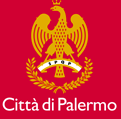

\ |IMG1|\ \ |IMG2|\ 

.. admonition:: Comunicato stampa del Comune di Palermo

    \ |IMG3|\  5.06.2018 \ |LINK1|\ 

 

.. _h312486d79423c3552b476c31f70c:

\ |LINK2|\ 
###########

Presentato a Palazzo delle Aquile il report finale di Smarter Cities Challenge, messo a punto da un team di esperti IBM per aiutare la città a trasformarsi.

Un‘anticipazione si era già avuta in occasione dell’evento svoltosi alla fine del periodo di permanenza in città del team di professionisti IBM che, a stretto contatto con l’Amministrazione Comunale, aveva lavorato sul campo per tre settimane. Ora l’Amministrazione intende mettere a disposizione dei cittadini il rapporto finale che contiene le raccomandazioni elaborate con l’obiettivo di aiutare la città di Palermo a trasformarsi in un comune ancora più inclusivo per migranti, nuovi residenti e cittadini, attraverso l'uso della tecnologia e di partnership sostenibili.

Il report, frutto di oltre 45 ore di incontri, più di 30 interviste agli stakeholder della città e dell'applicazione di un approccio di ``Design Thinking`` strutturato, fornisce indicazioni su come accelerare l'inclusione sociale a beneficio di tutti i cittadini di Palermo. Le aree critiche già presentate nel primo evento – la gestione integrata dell’ ``accoglienza dei migranti``, il ruolo innovativo della tecnologia nella gestione di questo come di molti altri processi critici per la città, le comunicazioni e gli strumenti per favorire la partecipazione e l’aggregazione di associazioni ed enti presenti nel tessuto cittadino che rappresentano una ricchezza da valorizzare, i problemi legati all’occupazione - nel rapporto sono state analizzate nel dettaglio e per ognuna di esse sono stati proposti progetti specifici. \ |STYLE0|\  suddivise per ognuna delle aree critiche.

Grande attenzione è dedicata a come la ``tecnologia`` attraverso il suo uso più efficace e integrato potrebbe migliorare molti ``processi``. Per rafforzare ulteriormente la capacità della Città di essere inclusiva, si potrebbe sviluppare un processo end-to-end, passando da un approccio manuale e non uniforme a uno integrato e sistematico, basato sulle ``competenze`` delle persone coinvolte e sostenuto dalla tecnologia, che abbia inizio nel momento in cui l’Amministrazione viene informata dell'arrivo di una nave in porto fino al momento in cui ciascun migrante sarà in grado di ottenere asilo o una residenza legale.

L’uso efficace della tecnologia per fare di Palermo una città pienamente inserita nella ``rivoluzione digitale`` in corso deve essere sostenuto da importanti interventi nel campo dell’ ``istruzione``. In questa area Palermo potrebbe valorizzare il lavoro svolto con importanti istituzioni, come l’UNICEF e l’Università, per sviluppare ulteriormente una piattaforma di ``e-learning`` che promuova le competenze professionali di base, le competenze linguistiche dell’italiano e l'appropriazione dei codici e contenuti culturali del nostro Paese per accelerare l’integrazione sociale. Inoltre, sarebbe necessaria la messa a punto di un processo formale per ottenere il diploma obbligatorio previsto dalla normativa italiana per le persone che sono state istruite altrove, fornendo loro le basi necessarie per trovare un lavoro o proseguire i loro studi, cosa che costituirebbe un formidabile acceleratore verso l’inclusione.

Altrettanto importanti sono gli interventi proposti nel campo della ``comunicazione``, non solo al fine di favorire un più rapido e mirato ``accesso alle informazioni`` – ampliando, ad esempio, l’esistente sito web del Comune per fare in modo che tutti i palermitani sappiano che questo è il luogo centrale in cui trovarle - ma anche come strumento in grado di promuovere  l’aggregazione di enti, istituzioni, organizzazioni di volontariato e singoli cittadini in un processo di ``comunicazione bilaterale`` con l’Amministrazione.  

Ovviamente fare di Palermo una città Smarter e sempre più inclusiva, richiede un sistema di gestione integrato che guidi e supervisioni la realizzazione delle raccomandazioni contenute nel report. Un metodo di ``governance`` per monitorare i progressi e mantenere l’attenzione sul raggiungimento dei risultati è fondamentale per la riuscita del percorso progettuale.

“Dopo avere ottenuto il Premio IBM Foundation di Smarter City in una competizione con oltre cento città in tutto il mondo – ha dichiarato il Sindaco, Leoluca Orlando - abbiamo recepito il report redatto da un gruppo di consulenti internazionali che hanno monitorato la realtà palermitana e l’amministrazione della città, formulando una serie di suggerimenti ed indicazioni utili per continuare il cammino  di ``cambio culturale`` di questa nostra città che vuole coniugare innovazione e rispetto dei diritti della persona umana”.  

"A completamento del lavoro svolto dagli esperti IBM a Palermo, il rapporto presentato oggi vuole essere un contributo utile per aiutare la città a sviluppare piani di intervento per il suo futuro”, ha dichiarato Angelo Failla Direttore della Fondazione IBM Italia. “IBM è da sempre impegnata a promuovere ciò che può stimolare l'inclusione ed è convinta che \ |STYLE1|\ . Palermo potrà trovare nelle raccomandazioni presentate in questo rapporto stimoli e indicazioni operative per portare a termine con successo la sfida che ha lanciato a se stessa partecipando al programma IBM Smarter Cities Challenge”.

Il rapporto prende in considerazione anche altre aree di attenzione, come quello della critica situazione dell’occupazione nella città. Un contributo in questo settore potrebbe arrivare dalla realizzazione di un portale online “one-stop” per i potenziali nuovi imprenditori palermitani, per dare loro accesso a tutte le informazioni e alla formazione necessarie ad avviare un’impresa.

Ognuna delle raccomandazioni presentate nel rapporto viene dettagliata con l’indicazione della finalità specifica, l’indicazione dei risultati attesi, l’individuazione del soggetto promotore e degli altri soggetti interessati, la chiara pianificazione di milestones e tempistiche.

Dal 2010, IBM ha conferito lo Smarter Cities Challenge grant a oltre 130 città in tutto il mondo, scelte tra oltre 600 candidate, grazie al lavoro di quasi 800 tra i migliori esperti di IBM che hanno proposto servizi pro bono per un valore superiore a 68 milioni di dollari. Ogni incarico di consulenza ha un valore commerciale di circa 500.000 dollari.

..  Important:: 

    \ |LINK3|\  \ |STYLE2|\ 

.. toctree::  
    :maxdepth: 4
    :caption: Contenuti

    1-executive_summary
    2-introduzione
    3-osservazioni
    4-raccomandazioni
    5-conclusione
    6-appendice

.. bottom of content

.. |STYLE0| replace:: **Dodici le raccomandazioni**

.. |STYLE1| replace:: **le tecnologie digitali possano supportare l'innovazione in aree critiche per favorire lo sviluppo sociale sostenibile**

.. |STYLE2| replace:: **redatto da IBM in formato pdf**

.. |LINK1| raw:: html

    <a href="https://www.comune.palermo.it/noticext.php?cat=1&id=18564" target="_blank">presentazione Report finale Palermo Smarter City Challenge</a>

.. |LINK2| raw:: html

    <a href="https://www.comune.palermo.it/noticext.php?cat=1&id=18564" target="_blank">Palermo città più inclusiva grazie alla tecnologia</a>

.. |LINK3| raw:: html

    <a href="https://www.comune.palermo.it/js/server/uploads/_05062018171816.pdf" target="_blank">Link al Report Smarter Cities Challenge Palermo 2017</a>

